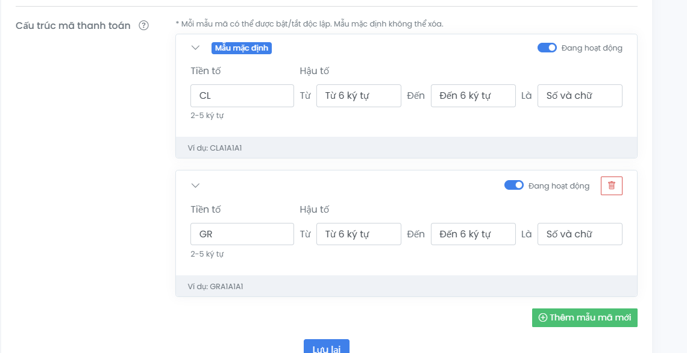
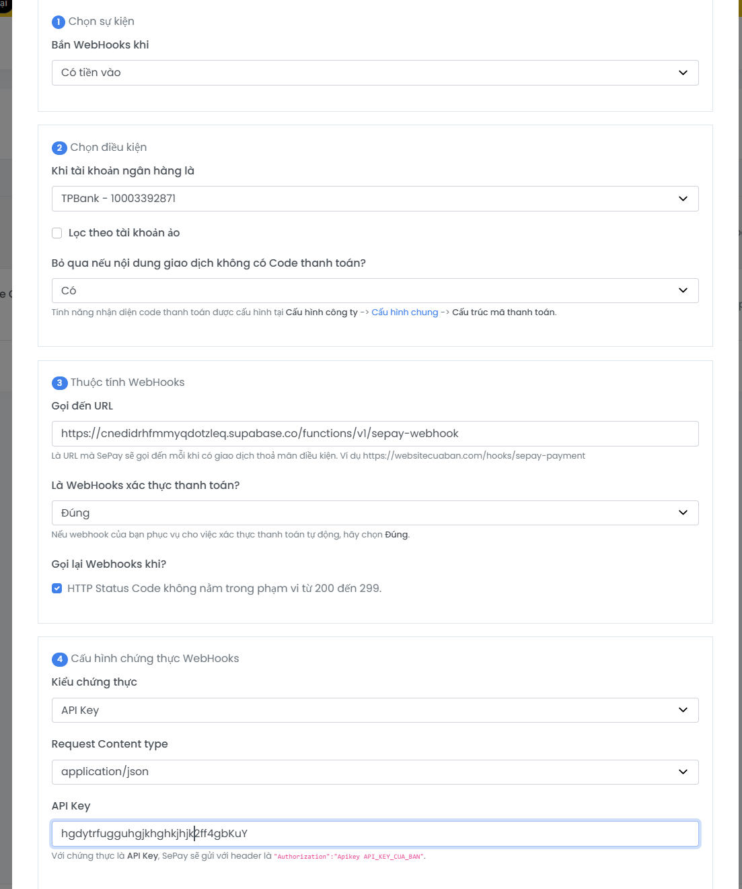

# SQL Export Bundle

This folder contains SQL files generated from your current Supabase database (`public` schema) so your friend can recreate an equivalent system.

## Source of truth

- This folder is the only database source of truth for this repo.
- `supabase/migrations` is intentionally empty and not used.
- Every DB/RPC/RLS change must be updated directly in these SQL files.

## Run order

1. `00_extensions.sql`
2. `01_enums.sql`
3. `02_tables.sql`
4. `03_constraints.sql`
5. `04_indexes.sql`
6. `05_views.sql`
7. `06_functions.sql`
8. `07_triggers.sql`
9. `08_rls.sql`

## Important

- This bundle recreates only `public` schema objects (no seed data).
- `auth.users` data is not included. Your friend needs to create users separately.
- Edge Functions are not included in SQL. Deploy them separately (`sepay-webhook` is the standard provider; `casso-webhook` is legacy only).
- Current schema expects:
  - enum `payment_status` for `session_costs_snapshot.status`
  - column `sessions.deleted_at` for soft-delete flow
  - column `session_payments.note` for manual-payment notes

## Post-import sanity check

- Verify `bank_config` has at least 1 active row (`is_active = true`) or FE will use fallback bank data.
- Verify RPCs exist: `soft_delete_cancelled_session`, `soft_delete_cancelled_sessions_bulk`, `get_session_delete_impact`, `gc_soft_deleted_sessions`.
- Verify Edge Functions are `ACTIVE` and `verify_jwt=false` for external webhooks.

## Webhook and SePay Setup

- Preferred provider: SePay.
- Casso should not be used for new setup. It is mainly suitable for OA/Biz account flow.
- For both webhook functions, keep `verify_jwt = false` because calls come from external provider.
- Required Edge Function secrets:
  - `SUPABASE_URL`
  - `SUPABASE_SERVICE_ROLE_KEY`
  - `SEPAY_API_TOKEN`
  - `CASSO_TOKEN` (only if you still keep `casso-webhook` for legacy)
- SePay webhook URL format:
  - `https://<project-ref>.supabase.co/functions/v1/sepay-webhook`
- SePay header expected by current code:
  - `Authorization: Apikey <SEPAY_API_TOKEN>`
- Transfer content must include code format:
  - `CLXXXXXX` for single payment
  - `GRXXXXXX` for group payment

### code patterns

### webhook config

## for supase admin

Step 1: create new user in `<project-ref>.supabase.co/auth/v1/admin/users` with email and password.
Step 2: assign copy that user into `members` with role `admin`
